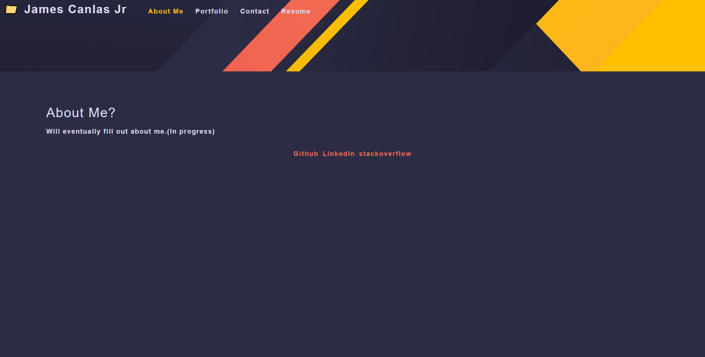

# 20-my-professional-react-portfolio

## Purpose
This project was made using react to display a single page application of my portfolio. This page has 4 sections(about me, portfolio, contact, and resume).

## Table of Contents
  * [Built With](#built-with)
  * [Screenshot](#screenshot)
  * [Links](#links)

## Built-With
- JavaScript
- React

## ScreenShots
* Screenshot of deployed website(with internet)   
  

## Links
[Repo Link](https://github.com/jcc83267/19-Budget-Tracker)  
[Deployed Site Link](https://jcc83267-budget-tracker.herokuapp.com/) 
